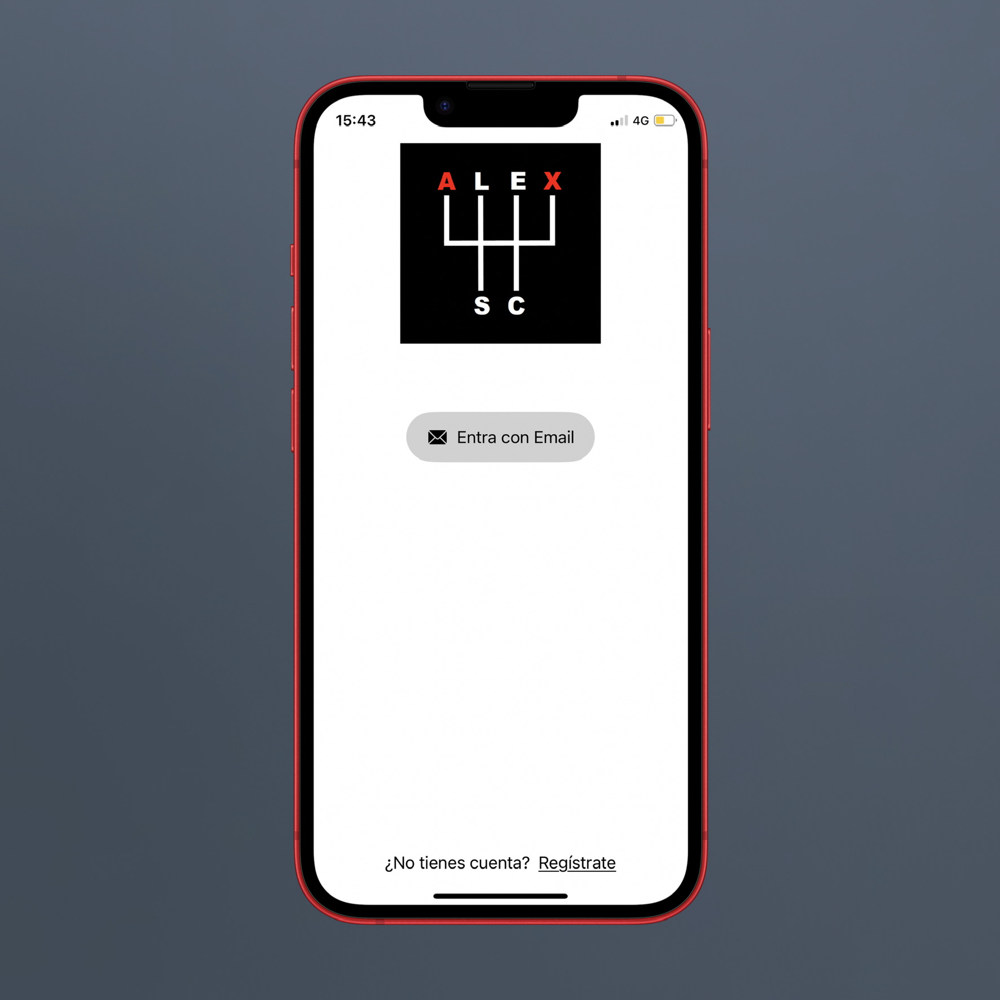
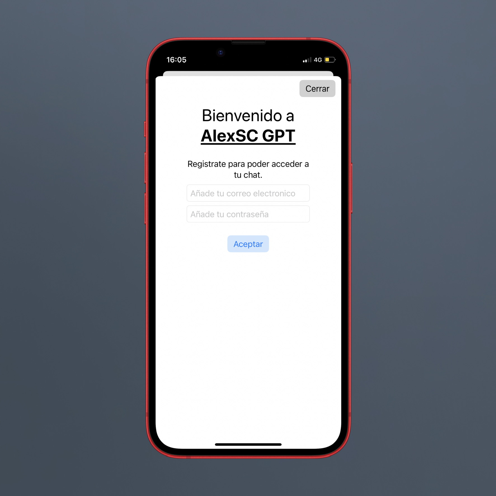
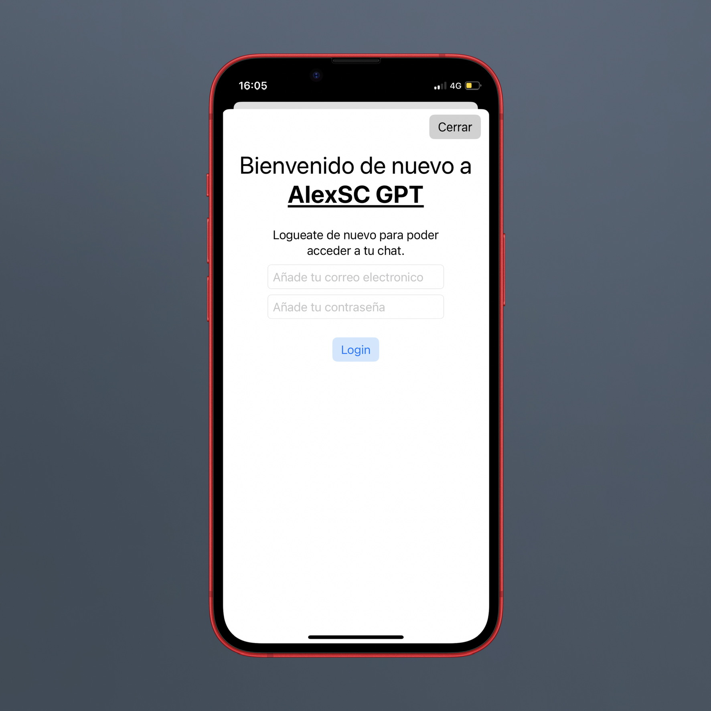

# alexgpt
Una app para conectarse a ChatGPT desarrollada por mi en Swift.

## ¿Como funciona la app ?
Para poder utilizar la app correctamente necesitaras:

- Una clave API de ChatGPT. Puedes ver como crear una aqui: https://blog.alexsc.dev/obtener-api-chatgpt/

- Necesitaras una cuenta gratuita a FireBase, crear un proyecto y poner tu clave API en el archivo GoogleService-Info.plist

### Vista de inicio

### Vista de registro

### Vista de Inicio de Sesion

### Vista de la App

